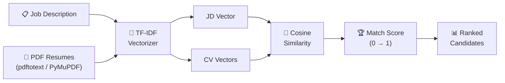

# Candidate Matching Tool

<p align="center">
  
  
  
  
  
  
</p>

An **AI-powered candidate-to-job matching tool** that ranks PDF resumes against a job description using TF-IDF cosine similarity and custom scoring. Has a Flask web UI and a standalone CLI script.

---

## 🏗️ Matching Pipeline



---

## 🚀 Quick Start

```bash
git clone https://github.com/ahmadalsharef994/candidate-matching-tool.git
cd candidate-matching-tool
cp .env.example .env

# Docker (recommended — no setup needed)
docker compose up --build
# → http://localhost:5000

# Or locally
pip install -r requirements.txt
python -m flask --app app/main.py run
```

Drop PDF resumes into `CVs/` (see `CVs/README.md`), paste your job description into the UI, and click **Match**.

---

## 📊 Sample Output

Given a job description for a *Senior Python Backend Engineer*, the tool ranks candidates:

| Rank | Candidate      | Score | Top Keywords                              |
|------|----------------|-------|-------------------------------------------|
| 1    | john_doe.pdf   | 0.87  | python, fastapi, backend, api, postgresql |
| 2    | jane_smith.pdf | 0.71  | machine learning, sql, scikit-learn       |
| 3    | bob_jones.pdf  | 0.54  | javascript, react, node.js                |
| 4    | alice_wang.pdf | 0.38  | java, spring, microservices               |

Scores are cosine similarity between TF-IDF vectors of the job description and each resume. A score above **0.70** is a strong match.

---

## 📋 Features

- PDF parsing via `pdftotext` and `PyMuPDF` (handles scanned PDFs)
- TF-IDF vectorization with stop-word filtering and stemming
- Multiple similarity algorithms: cosine, ISC, sqrt-cosine
- Flask web UI with drag-and-drop upload
- Standalone CLI: `match_resumes.py`

---

## 📄 License

MIT
