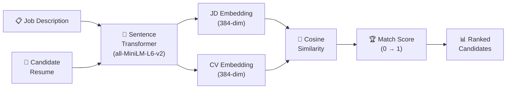

# Candidate Matching Tool

<p align="center">
  
  
  
  
  
</p>

An **AI-powered candidate-to-job matching tool** that uses sentence transformers and cosine similarity to rank candidates against job descriptions. Removes keyword-matching bias and understands semantic relevance.

---

## 🏗️ Matching Pipeline



---

## 🚀 Quick Start

```bash
pip install -r requirements.txt
uvicorn app:app --reload
```

### Match via API

```bash
curl -X POST http://localhost:8000/match \
  -H "Content-Type: application/json" \
  -d '{
    "job_description": "Senior Python backend engineer...",
    "candidates": [
      {"id": "c1", "resume": "5 years Python, FastAPI, PostgreSQL..."},
      {"id": "c2", "resume": "React developer with 3 years experience..."}
    ]
  }'
```

**Response:**
```json
{
  "ranked": [
    {"id": "c1", "score": 0.89, "rank": 1},
    {"id": "c2", "score": 0.41, "rank": 2}
  ]
}
```

---

## 📊 Features

- Semantic matching (not just keyword overlap)
- Batch scoring of multiple candidates
- Configurable similarity threshold
- CSV bulk import/export

---

## 📄 License

MIT
